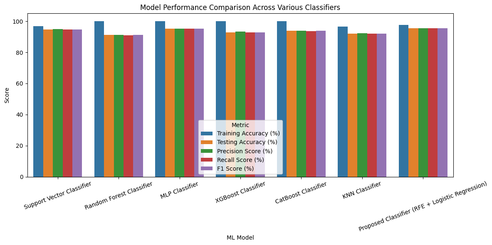
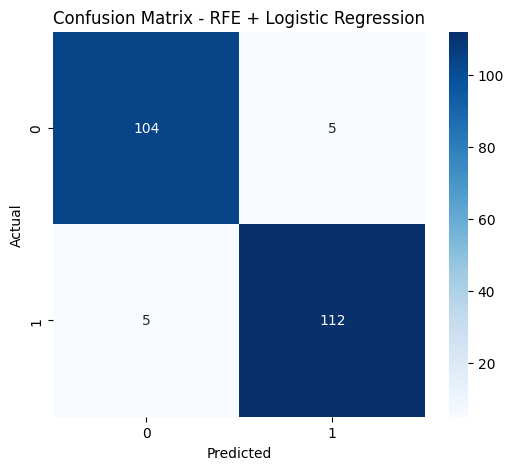
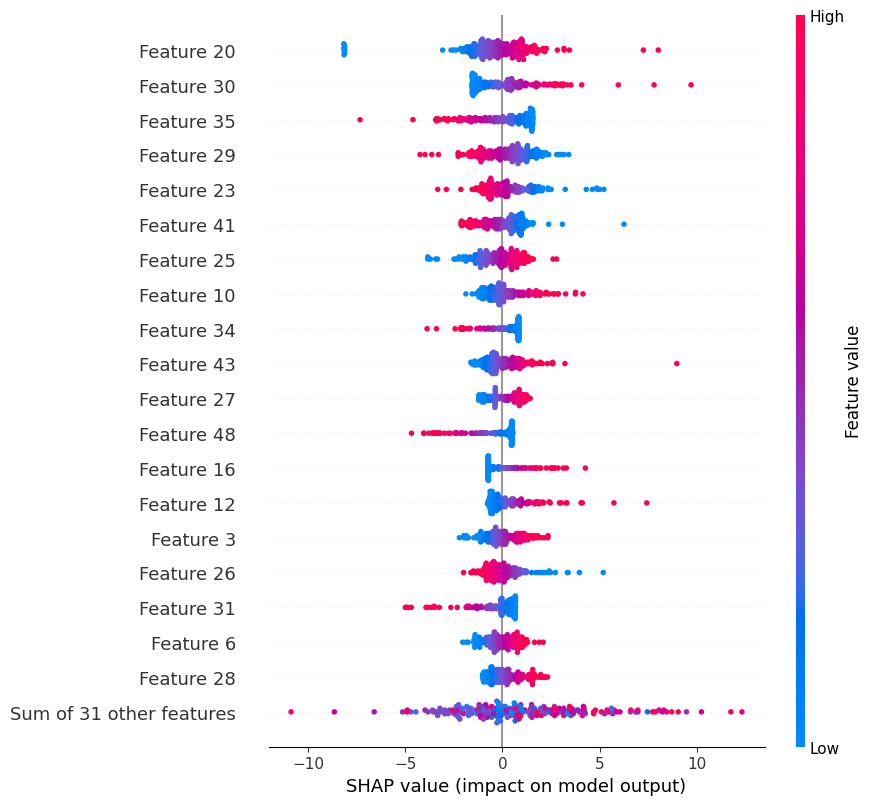

# Early Prediction of Parkinson's Disease using Machine Learning


### Overview

This repository contains the **official implementation** of the paper:

> **"Design of an Early Prediction Model for Parkinson's Disease Using Machine Learning"**  
> *by K. VELU and N. JAISANKAR (Member, IEEE)*  
> *Published in IEEE Access, Vol. 13, 2025*  
> [DOI: 10.1109/ACCESS.2025.3533703](https://doi.org/10.1109/ACCESS.2025.3533703)

The proposed **XRFILR (Explainable balanced Recursive Feature Importance with Logistic Regression)** model achieves **96.46% accuracy** in early Parkinson's Disease (PD) detection using speech biomarkers, while providing full model interpretability via **SHAP analysis**.


## Key Features

| Feature | Description |
|---------|-------------|
| **High Accuracy** | 96.46% testing accuracy, outperforming SVM, XGBoost, RF, and MLP |
| **Class Balancing** | KMeansSMOTE for handling imbalanced medical datasets |
| **Feature Selection** | Recursive Feature Elimination (RFE) with Logistic Regression |
| **Explainability** | SHAP (SHapley Additive exPlanations) for clinical interpretability |
| **Non-invasive** | Based on voice/speech feature analysis (756 MDVP-based features) |
| **Standard Dataset** | UCI Parkinson's Disease Classification dataset |


## Methodology Overview

```
┌─────────────────┐     ┌──────────────────┐     ┌─────────────────┐
│  UCI PD Dataset │────▶│  Standardization │────▶│  KMeansSMOTE   │
│  (756 samples)  │     │  (StandardScaler)│     │  (Class Balance)│
└─────────────────┘     └──────────────────┘     └────────┬────────┘
                                                          │
                                                          ▼
┌─────────────────┐     ┌──────────────────┐     ┌─────────────────┐
│  Model Training │◀────│  RFE Feature     │◀────│  Train-Test    │
│  (7 Classifiers)│     │  Selection (→50) │     │  Split (80/20)  │
└────────┬────────┘     └──────────────────┘     └─────────────────┘
         │
         ▼
┌─────────────────────────────────────────────────────────────┐
│  Proposed XRFILR: Logistic Regression + RFE + SHAP          │
│  Accuracy: 96.46% | Precision: 96.46% | Recall: 96.46%      │
│  ROC-AUC: 0.99                                              │
└─────────────────────────────────────────────────────────────┘
```


## Results Comparison



| Model | Testing Accuracy | Precision | Recall | F1-Score |
|-------|----------------:|----------:|-------:|---------:|
| **Proposed XRFILR** | **96.46%** | **96.46%** | **96.46%** | **96.46%** |
| XGBoost | 95.13% | 95.41% | 95.13% | 95.12% |
| MLP Classifier | 94.25% | 94.25% | 94.25% | 94.25% |
| SVM | 93.36% | 93.93% | 93.36% | 93.33% |
| CatBoost | 92.92% | 93.13% | 92.92% | 92.91% |
| Random Forest | 92.48% | 93.03% | 92.48% | 92.45% |
| KNN | 90.71% | 90.71% | 90.71% | 90.71% |

> **Comparison with ablation study (PCA variant):**  
> With PCA + Logistic Regression → 87.17% accuracy (confirms RFE superiority)


## Dataset

- **Source**: [UCI Machine Learning Repository - Parkinson's Disease Classification](https://archive.ics.uci.edu/dataset/470/parkinson++s+disease+classification)
- **Samples**: 756 (188 PD patients + 64 healthy controls after balancing)
- **Features**: 753 speech-based MDVP features (jitter, shimmer, HNR, DFA, RPDE, PPE, etc.)
- **Target**: Binary (0 = Healthy, 1 = Parkinson's Disease)


## Project Structure
```
├── parkinson_1.ipynb                          # Main implementation notebook
├── Design_of_an_Early_Prediction_Model...pdf  # Original paper                         
├── README.md                                  # This file
└── dataset/
    └── pd_speech_features.csv
```

## Visual Results

### Confusion Matrix (XRFILR)


### ROC Curves (All Models)

| Rank | Model(s) | AUC Score |
|------|----------|-----------|
|   1  | MLP Classifier & Logistic Regression | **0.99** |
|   2  | XGBoost, SVM, Random Forest, CatBoost | **0.98** |
|   3  | KNN | **0.97** |

### SHAP Feature Importance

> **Key Insight:**  
> **Feature 41** (HNR — Harmonics-to-Noise Ratio) is identified as the **most influential predictor** in the XRFILR model for early Parkinson's Disease detection.



## License

| Component | License |
|-----------|---------|
| Paper & Methodology | © IEEE & Original Authors (All rights reserved) |
| Code Implementation | [MIT License](https://opensource.org/licenses/MIT) |

> This code is provided for **academic reproducibility only**. Please cite the original paper for any scholarly use.